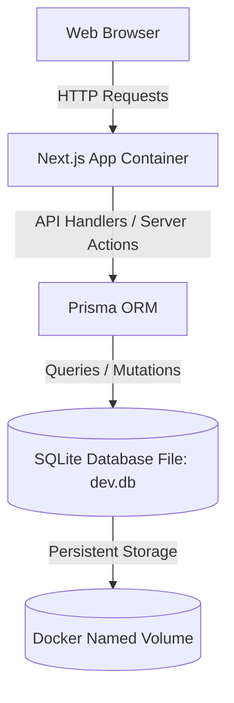

# Elegant Essence Backend & Dockerization Instruction Manual (SQLite Edition)

This document provides architectural instructions, configuration templates, and setup commands to transition **Elegant Essence** into a full-stack Next.js application backed by a lightweight SQLite database and orchestrated inside a Docker container.

---

## 1. Full-Stack Architecture Overview



We consolidate the frontend and backend inside the Next.js codebase. The app serves static components to users while exposing API endpoints under `/api/*` and communicating with a local SQLite database file (`prisma/dev.db`) using the Prisma ORM.

---

## 2. Database Layer (Prisma ORM)

Initialize Prisma in the workspace using `npx prisma init`. This creates a `prisma` folder containing `schema.prisma`.

### `prisma/schema.prisma`
Replace the contents of your schema file with the following database definitions.

> [!NOTE]
> SQLite does not support native `enum` types or the `Decimal` type.
> In this schema, roles, statuses, and payment fields are mapped to `String` and `Float` types.

```prisma
datasource db {
  provider = "sqlite"
  url      = env("DATABASE_URL")
}

generator client {
  provider = "prisma-client-js"
}

model User {
  id         String   @id @default(uuid())
  name       String
  email      String   @unique
  role       String   @default("Customer") // "Customer" | "Admin"
  status     String   @default("Active")   // "Active" | "Suspended"
  joined     DateTime @default(now())
  phone      String?
  address    String?
  preference String?
  orders     Order[]
  createdAt  DateTime @default(now())
  updatedAt  DateTime @updatedAt
}

model Product {
  id          String   @id @default(uuid())
  name        String
  category    String
  price       Float    @default(0.0)
  rating      Float    @default(5.0)
  reviews     Int      @default(0)
  imageBg     String
  description String
  notes       String[]
  ingredients String
  stock       Int      @default(0)
  createdAt   DateTime @default(now())
  updatedAt   DateTime @updatedAt
}

model Order {
  id        String      @id @default(uuid())
  date      DateTime    @default(now())
  total     Float
  status    String      @default("Processing") // "Processing" | "Shipped" | "Delivered"
  buyerId   String
  buyer     User        @relation(fields: [buyerId], references: [id], onDelete: Cascade)
  items     OrderItem[]
  createdAt DateTime    @default(now())
  updatedAt DateTime    @updatedAt
}

model OrderItem {
  id        String   @id @default(uuid())
  orderId   String
  order     Order    @relation(fields: [orderId], references: [id], onDelete: Cascade)
  name      String
  qty       Int
  volume    String
  price     Float
  createdAt DateTime @default(now())
}

model Transaction {
  id        String   @id @default(uuid())
  orderId   String   @unique
  customer  String
  date      DateTime @default(now())
  status    String   @default("Paid") // "Paid" | "Failed"
  amount    Float
  createdAt DateTime @default(now())
}
```

---

## 3. Backend API Route Structures

Create full backend endpoints under the `app/api/` folder using Next.js route handlers.

### A. Products Catalogue (`app/api/products/route.ts`)
```typescript
import { NextResponse } from "next/server";
import { PrismaClient } from "@prisma/client";

const prisma = new PrismaClient();

// GET all products with optional search query & category filter
export async function GET(request: Request) {
  const { searchParams } = new URL(request.url);
  const search = searchParams.get("search") || "";
  const category = searchParams.get("category") || "";

  try {
    const products = await prisma.product.findMany({
      where: {
        AND: [
          search ? { name: { contains: search } } : {},
          category && category !== "All" ? { category: { contains: category } } : {},
        ],
      },
    });
    return NextResponse.json(products);
  } catch (error) {
    return NextResponse.json({ error: "Failed to fetch products" }, { status: 500 });
  }
}

// POST new product (Admin action)
export async function POST(request: Request) {
  try {
    const body = await request.json();
    const product = await prisma.product.create({
      data: {
        name: body.name,
        category: body.category,
        price: parseFloat(body.price) || 0.0,
        imageBg: body.imageBg,
        description: body.description,
        notes: body.notes || [],
        ingredients: body.ingredients,
        stock: parseInt(body.stock) || 0,
      },
    });
    return NextResponse.json(product, { status: 201 });
  } catch (error) {
    return NextResponse.json({ error: "Failed to create product" }, { status: 550 });
  }
}
```

---

## 4. Dockerization Configurations

For efficient production container packaging and database file persistence, configure the following files in the project root:

### A. Next.js Config: `next.config.ts`
Enable Next.js to package only the traced dependencies needed for deployment, keeping the container size minimal.
```typescript
import type { NextConfig } from "next";
import path from "path";

const nextConfig: NextConfig = {
  output: "standalone", // <--- CRITICAL: Trims output bundle for Docker
  outputFileTracingRoot: path.join(__dirname, "../../"),
};

export default nextConfig;
```

### B. Container Build Spec: `Dockerfile`
Create a `Dockerfile` file in your root folder:
```dockerfile
# Multi-stage Next.js Dockerfile optimized for standalone mode with SQLite support
FROM node:20-alpine AS base

# 1. Install dependencies only when needed
FROM base AS deps
RUN apk add --no-cache libc6-compat
WORKDIR /app

# Install pnpm globally
RUN npm install -g pnpm

# Copy package configurations
COPY package.json pnpm-lock.yaml* pnpm-workspace.yaml* ./
RUN pnpm install --frozen-lockfile

# 2. Rebuild the source code only when needed
FROM base AS builder
WORKDIR /app
COPY --from=deps /app/node_modules ./node_modules
COPY . .

# Install pnpm and generate Prisma client
RUN npm install -g pnpm
RUN npx prisma generate || true

ENV NEXT_TELEMETRY_DISABLED=1
RUN pnpm run build

# 3. Production runner
FROM base AS runner
WORKDIR /app

ENV NODE_ENV=production
ENV NEXT_TELEMETRY_DISABLED=1

RUN addgroup --system --gid 1001 nodejs
RUN adduser --system --uid 1001 nextjs

# Create prisma directory and set ownership to allow SQLite database writes
RUN mkdir -p prisma && chown -y nextjs:nodejs prisma

# Copy standalone build directory and public files
COPY --from=builder /app/public ./public
COPY --from=builder --chown=nextjs:nodejs /app/.next/standalone ./
COPY --from=builder --chown=nextjs:nodejs /app/.next/static ./.next/static
COPY --from=builder --chown=nextjs:nodejs /app/prisma ./prisma

USER nextjs

EXPOSE 3000
ENV PORT=3000
ENV HOSTNAME="0.0.0.0"

CMD ["node", "server.js"]
```

### C. Services Orchestration: `docker-compose.yml`
Create a `docker-compose.yml` file in your root folder to run the app and persist the SQLite database:
```yaml
version: '3.8'

services:
  # Next.js web application service containing the embedded SQLite database
  web:
    build:
      context: .
      dockerfile: Dockerfile
    container_name: elegant_essence_web
    ports:
      - "3000:3000"
    environment:
      - DATABASE_URL=file:/app/prisma/dev.db
      - NODE_ENV=production
    volumes:
      - sqlite-data:/app/prisma
    restart: always

volumes:
  # Named volume to persist dev.db SQLite database file across updates
  sqlite-data:
```

### D. File Exclusions: `.dockerignore`
Create a `.dockerignore` file in your root folder:
```
node_modules
.next
out
build
dist
.git
.gitignore
.env*.local
README.md
Note.md
Backend Instruction.md
pnpm-debug.log
```

---

## 5. Startup & Deployment Guide

Follow these commands to build, initialize, and launch the dockerized cluster:

### Step 1: Spin up the Application Service
Build the container image and launch the service in detached mode:
```bash
docker compose up -d --build
```

### Step 2: Initialize Database Tables
Once the container is active, execute database migrations through Prisma to construct tables in your new `dev.db` file:
```bash
docker compose exec web npx prisma db push
```

### Step 3: Run Database Seed Scripts
Optionally run database seeds to fill SQLite with default catalogue products, admin users, and listings:
```bash
docker compose exec web npx prisma db seed
```
Now, navigate to **http://localhost:3000** to interact with the full-stack containerized app!
