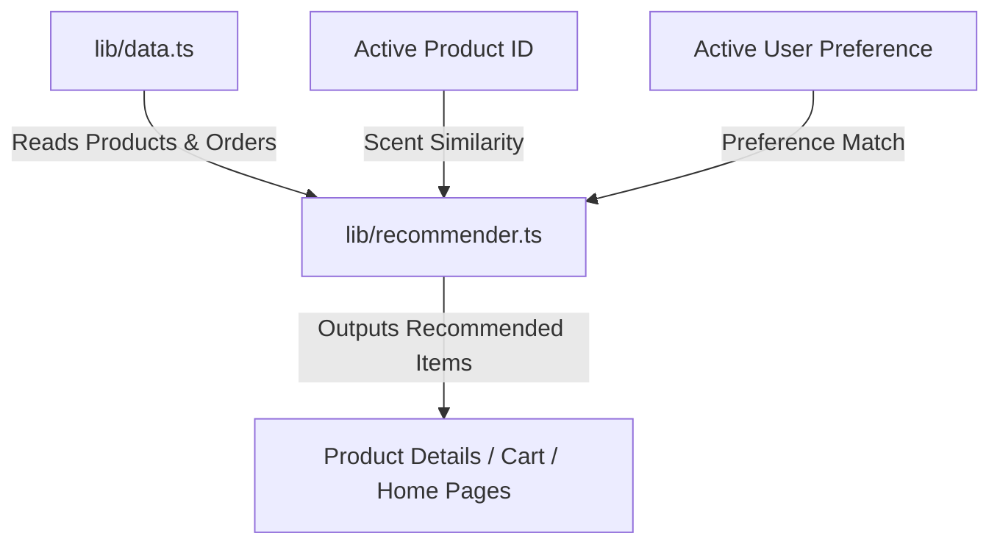

Yes, you can absolutely add a **recommender system** to this project. Since Elegant Essence is currently built on Next.js and uses structured product/order models, you can implement a highly personalized recommendation engine using the existing dataset.

---

### How the Recommender System Can Work

We can build a recommendation engine in `lib/recommender.ts` using three primary strategies:

1. **Content-Based Filtering (Scent Notes & Category Similarity)**:
   * Compares the `category` and olfactory `notes` (Top, Heart, and Base notes) of the current product against other products.
   * Calculates similarity scores (e.g., using Jaccard Similarity) to recommend products with matching scent profiles.
2. **Collaborative Filtering / Co-occurrence**:
   * Analyzes the order history in [INITIAL_ORDERS](file:///Users/y2k/react-practice/elegant_essence/lib/data.ts#L90) to determine which products are "Frequently Bought Together."
3. **User Preference Matching**:
   * Inspects the active user's `preference` field (e.g., `"Woody"`, `"Floral"`) from [INITIAL_USERS](file:///Users/y2k/react-practice/elegant_essence/lib/data.ts#L125) to show a personalized "Recommended For You" shelf on the Homepage.

---

### Suggested Architecture

Below is a conceptual layout of the recommendation engine and how it fits into the UI:



---

### Proposed Implementation Plan

If you want to proceed, we can implement this in three steps:

#### 1. Create the Recommendation Engine
We will create a new file `lib/recommender.ts` containing the algorithm logic:
```typescript
import { Product, Order } from "@/types";

// 1. Content-based similarity using scent notes & categories
export function getRelatedProducts(currentProduct: Product, allProducts: Product[], limit = 3): Product[] {
  return allProducts
    .filter((p) => p.id !== currentProduct.id && p.status !== "Out of Stock")
    .map((product) => {
      let score = 0;
      // Bonus if same category
      if (product.category === currentProduct.category) score += 3;
      
      // Look for overlapping olfactory notes (e.g., "Oud", "Bergamot", "Jasmine")
      const currentNotes = currentProduct.notes.flatMap(n => n.split(/[:,\s]+/));
      const targetNotes = product.notes.flatMap(n => n.split(/[:,\s]+/));
      const commonNotes = currentNotes.filter(n => targetNotes.includes(n));
      score += commonNotes.length * 1.5;

      return { product, score };
    })
    .sort((a, b) => b.score - a.score)
    .map((item) => item.product)
    .slice(0, limit);
}

// 2. Co-occurrence similarity ("Frequently Bought Together")
export function getFrequentlyBoughtTogether(productId: string, allOrders: Order[], allProducts: Product[], limit = 2): Product[] {
  // Find orders containing the product
  // Tally and rank other co-occurring items in those orders...
  return [];
}
```

#### 2. Integrate into the Product Details Page
We will modify [ProductDetailsClient](file:///Users/y2k/react-practice/elegant_essence/app/(root)/(routes)/products/[id]/ProductDetailsClient.tsx#L12) to fetch similar products using `getRelatedProducts` and display them in a **"You May Also Like"** section using [ProductCard](file:///Users/y2k/react-practice/elegant_essence/components/product/ProductCard.tsx#L10) component.

#### 3. Personalize the Home Page
We can filter/sort products on the homepage based on the active customer's preference profile.

---

### Would you like to proceed?
If you'd like me to implement this recommender system, let me know! I can write the logic, set up the UI components, and make sure it integrates smoothly into your pages.